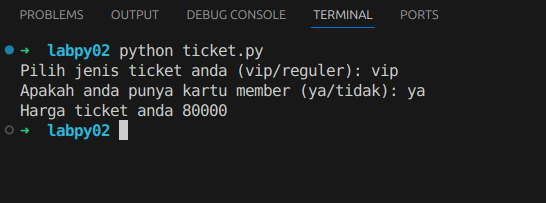
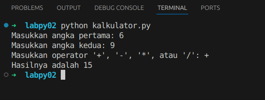

# Sistem Pembelian Tiket
Program sederhana untuk menghitung harga tiket berdasarkan jenis tiket dan status member.

## Deskripsi Program
Program ini memungkinkan pengguna untuk:

Memilih jenis tiket (VIP/Reguler)
Menentukan status member
Mendapatkan perhitungan harga tiket final dengan diskon jika memiliki kartu member

## Flowchart Ticket
````mermaid
flowchart TD
    A[Start] --> B[Set harga tiket VIP = 100000]
    B --> C[Set harga tiket Reguler = 50000]
    C --> D{Input jenis tiket}
    A([Start]) --> B[Set Harga VIP = 100000]
    B --> C[Set Harga Reguler = 50000]
    C --> D[/Input Jenis Tiket/]
    
    D -->|vip| E[harga_ticket = 100000]
    D -->|reguler| F[harga_ticket = 50000]
    D -->|input lain| G[Print 'Input tidak valid']
    G --> H[Exit]
    D --> E{Jenis Tiket Valid?}
    E -->|VIP| F[Tetapkan Harga = 100000]
    E -->|Reguler| G[Tetapkan Harga = 50000]
    E -->|Tidak Valid| H[/Tampilkan Pesan Error/]
    
    E --> I{Input kartu member}
    F --> I
    F --> I[/Input Status Member/]
    G --> I
    H --> J([Exit])
    
    I -->|ya| J[Hitung diskon 20%]
    I -->|tidak| K[Tidak ada diskon]
    I --> K{Member?}
    K -->|Ya| N[harga_ticket -= harga_ticket * 0.20]
    K -->|Tidak| O[/Tampilkan Harga Akhir/]
    
    J --> L[Print harga akhir]
    K --> L
    
    L --> M[End]
    N --> O[/Tampilkan Harga Akhir/]
    O --> P([End])
````
## Contoh Output Program



## Cara Kerja Program:

1. Program menentukan harga awal:
   - Tiket VIP: Rp 100.000
   - Tiket Reguler: Rp 50.000

2. User diminta memilih jenis tiket:
   - Jika memilih "vip", harga diset Rp 100.000
   - Jika memilih "reguler", harga diset Rp 50.000
   - Jika input selain keduanya, program berhenti dengan pesan "Input tidak valid"

3. User diminta konfirmasi kepemilikan kartu member:
   - Jika memiliki kartu member (input "ya"), akan mendapat diskon 20%
   - Jika tidak memiliki (input "tidak"), tidak ada diskon

4. Program menampilkan harga akhir setelah perhitungan diskon

Contoh perhitungan:
- Jika pilih VIP dan punya member:
  Rp 100.000 - (20% × Rp 100.000) = Rp 80.000
- Jika pilih Reguler dan punya member:
  Rp 50.000 - (20% × Rp 50.000) = Rp 40.000


# Program Kalkulator Sederhana
Program kalkulator sederhana untuk menghitung inputan dari user.

## Deskripsi Program
Program kalkulator sederhana yang mampu melakukan operasi dasar matematika dengan dua bilangan, user bisa memilih operasi yang ingin mereka lakukak (+,-.x.\).

## Flowchaart Kalkulator


````mermaid
flowchart TD
    A([Start]) --> B[/Input Angka Pertama/]
    B --> C[/Input Angka Kedua/]
    C --> D[/Input Operator/]
    
    D --> E{Operator Valid?}
    E -->|Tambah '+'| F[Hitung a + b]
    E -->|Kurang '-'| G[Hitung a - b]
    E -->|Kali '*'| H[Hitung a * b]
    E -->|Bagi '/'| I[Hitung a / b]
    E -->|Operator Lain| J[/Tampilkan Error/]
    
    F --> K[/Tampilkan Hasil/]
    G --> K
    H --> K
    I --> K
    
    J --> L([Exit])
    K --> M([End])

````
## contoh output program



## Cara Kerja Program

### Alur Proses Kalkulator
1. Program meminta input angka pertama
2. Program meminta input angka kedua
3. Program meminta input operator matematika
4. Fungsi `kalkulator()` memproses input sesuai operator
5. Menampilkan hasil perhitungan
